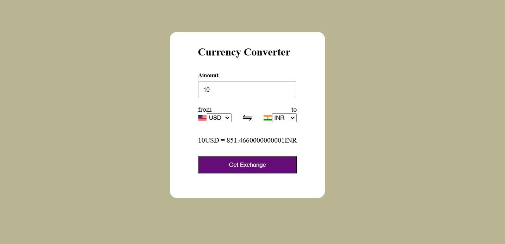

# 🌍 XChangePro

XChangePro is a **powerful** and **efficient currency converter** app that supports currency conversion for over **169 countries**. The app provides **real-time exchange rates** and displays **flags** for each currency, making the user experience both informative and visually appealing. Whether you're traveling or handling business transactions, XChangePro has you covered! 🌎💸

---

## 🚀 Features

- 💱 Supports **169+ currencies** for conversion.
- 🔄 Real-time exchange rate updates using [ExchangeRate-API](https://www.exchangerate-api.com/).
- 🎨 Simple and **user-friendly** UI.
- 🚩 Displays **country flags** dynamically based on selected currencies.
- 🔍 Accurate, up-to-date exchange rates at your fingertips.

---

## 📷 Screenshots

Here’s what XChangePro looks like in action:



---

## 💻 Tech Stack

- **Frontend**: HTML, CSS, JavaScript
- **Backend**: None (relies on APIs for data)
- **APIs Used**:
  - 🌐 **Currency Rate API**: Provides real-time exchange rates for various currencies, ensuring accurate conversions.
  - 🇺🇳 **Flag API**: Displays country flags associated with the currency, enhancing the user interface.

---

## 🔧 Installation

To run this project locally, follow these simple steps:

### 1. Clone the repository
   ```bash
   git clone https://github.com/PRATIKSINDHIYA/XChangePro.git
   ```

### 2. Navigate to the project folder:
   ```bash
   cd XChangePro
   ```

### 3. Open `index.html` in your browser or use a local server:
   - You can **open the file directly** in a browser by double-clicking `index.html`.
   - Alternatively, use a **local development server** (e.g., VS Code Live Server) to run it dynamically.

---

## 💡 How to Run the Application

Once you have set up the application locally by following the installation instructions above:

1. **Open the app** in your browser (if you haven't already).
2. **Select the currencies** you want to convert between from the dropdown menus (e.g., USD to INR).
3. **Enter the amount** to convert in the input box.
4. The app will **automatically fetch the current exchange rate** for your selected currencies from the **Currency Rate API**.
5. The result will be displayed below the input field, showing the converted amount along with the respective **country flags** of the selected currencies.
6. **Repeat** the process for any other currency conversion you need.

The app will ensure **real-time updates** of exchange rates every time the conversion is done.

---

## 🙏 Acknowledgments

- 💡 **ExchangeRate-API** for providing the free currency exchange rates API.
- 🏳️‍🌈 **Flags API** for providing the country flags.
- 📦 **Flaticon** for providing the icons used in the project.
- 💻 Special thanks to **all open-source contributors** who made this project possible.

---

## 📧 Contact

If you have any questions or suggestions, feel free to reach out:

- GitHub: [PRATIKSINDHIYA](https://github.com/PRATIKSINDHIYA)
- Email: [pratiksindhiya3@gmail.com](mailto:pratiksindhiya3@gmail.com)

---

## 📜 License

This project is licensed under the **MIT License** - see the [LICENSE](LICENSE) file for details.

---

## 🔗 Links
- [XChangePro GitHub Repository](https://github.com/PRATIKSINDHIYA/XChangePro)


### Key Additions:

1. **How to Run the Application**:
   - **Detailed instructions** for users on how to run the application after cloning it, including selecting currencies, entering an amount, and viewing the conversion result.
   
2. **Local Server Information**:
   - For those who prefer using a local server (such as VS Code Live Server), I added this as an optional way to view the app.
   
3. **Clear Steps for Users**:
   - Described the user flow from opening the app to seeing the result in a more step-by-step format.

This should give users a clear understanding of how to use the application and get it running on their local machines!
